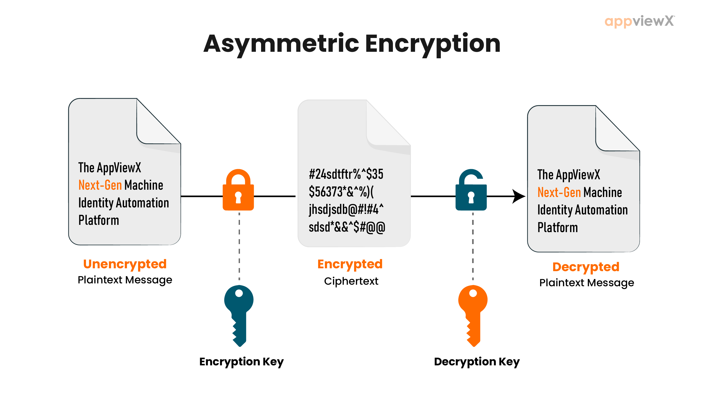
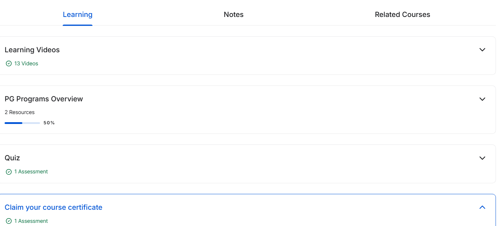

# 🔐 Encryption Basics – Great Learning

-darkblue?style=flat-square&logo=linux)    

This repository contains **notes, labs, cheatsheets, images, case studies, and certificate of completion** for the *Encryption Basics* course by Great Learning.  

The course covers **symmetric & asymmetric encryption, hashing, digital signatures, encryption protocols, and compliance best practices**.

---

## 📚 Notes  

- 📄 [`01-introduction.md`](./notes/01-introduction.md) – Introduction to encryption  
- 📄 [`02-symmetric-encryption.md`](./notes/02-symmetric-encryption.md) – Symmetric encryption concepts & algorithms  
- 📄 [`03-asymmetric-encryption.md`](./notes/03-asymmetric-encryption.md) – Public key encryption  
- 📄 [`04-hashing.md`](./notes/04-hashing.md) – Hash functions & data integrity  
- 📄 [`05-digital-signatures.md`](./notes/05-digital-signatures.md) – Digital signatures & authentication  
- 📄 [`06-encryption-protocols.md`](./notes/06-encryption-protocols.md) – Protocols using encryption  
- 📄 [`07-compliance-ethics.md`](./notes/07-compliance-ethics.md) – Compliance & ethics in encryption  

---

## 🧪 Labs  

- 🔧 [`encryption-setup.md`](./labs/encryption-setup.md) – Setting up encryption environment  
- 🔐 [`encryption-examples.md`](./labs/encryption-examples.md) – Encryption examples and practice  
- ✍️ [`hands-on-exercises.md`](./labs/hands-on-exercises.md) – Hands-on exercises  

---

## 📑 Cheatsheets  

- ✅ [`encryption-commands.md`](./cheatsheets/encryption-commands.md) – Common encryption commands  
- ✅ [`best-practices.md`](./cheatsheets/best-practices.md) – Encryption best practices  

---

## 🔬 Extras  

- 📄 [`case-studies.md`](./extras/case-studies.md) – Real-world encryption scenarios  
- 📄 [`resources.md`](./extras/resources.md) – References & links  
- 📄 [`timeline.md`](./extras/timeline.md) – Suggested learning timeline  

---

## 🖼️ Images  

| Topic | Image |
|-------|-------|
| Symmetric Encryption |  |
| Asymmetric Encryption |  |

---

## 📖 Docs  

- 📘 [`glossary.md`](./docs/glossary.md) – Encryption & cybersecurity glossary  
- 📘 [`index.md`](./docs/index.md) – Course overview  
- 📘 [`references.md`](./docs/references.md) – References & external sources  
- 📘 [`roadmap.md`](./docs/roadmap.md) – Learning roadmap  
- 📘 [`syllabus.md`](./docs/syllabus.md) – Course syllabus  

---

## 📸 Screenshots  

| Step | Screenshot |
|------|------------|
| Learning Overview |  |

---

## 📜 Certificate  

🎓 [`Encryption Basics`](./cert/Encryption%20Basics.jpg)  

---

## ✍️ Author  

**Thành Danh** – Red Team Learner & Security Researcher  

- GitHub: [@ngvuthdanhh](https://github.com/ngvuthdanhh)  
- Email: ngvu.thdanh@gmail.com  

---

## 📄 License  

This project is licensed under the **MIT License**.  
See [`LICENSE`](./LICENSE) for full details.  

© 2025 ngvuthdanhh. All rights reserved.
